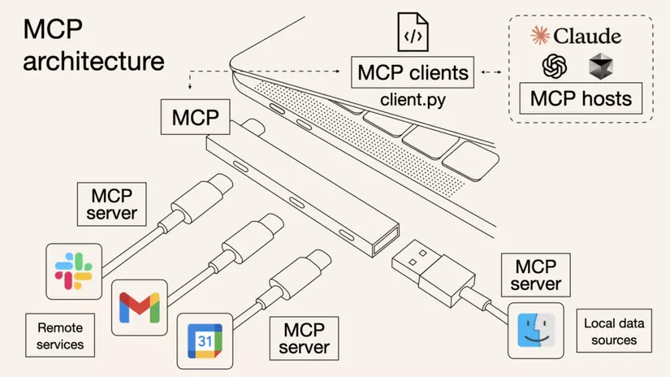
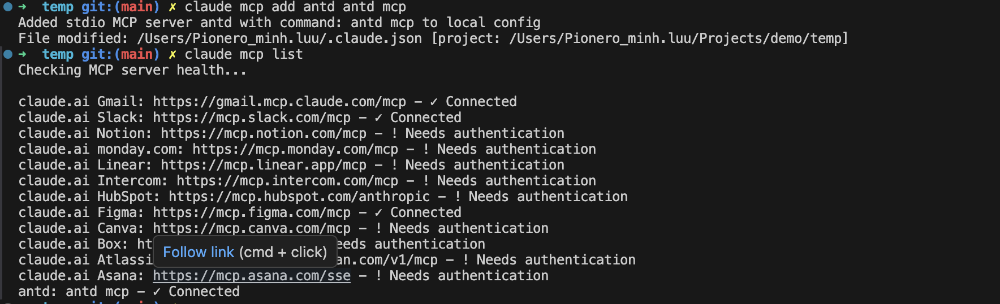
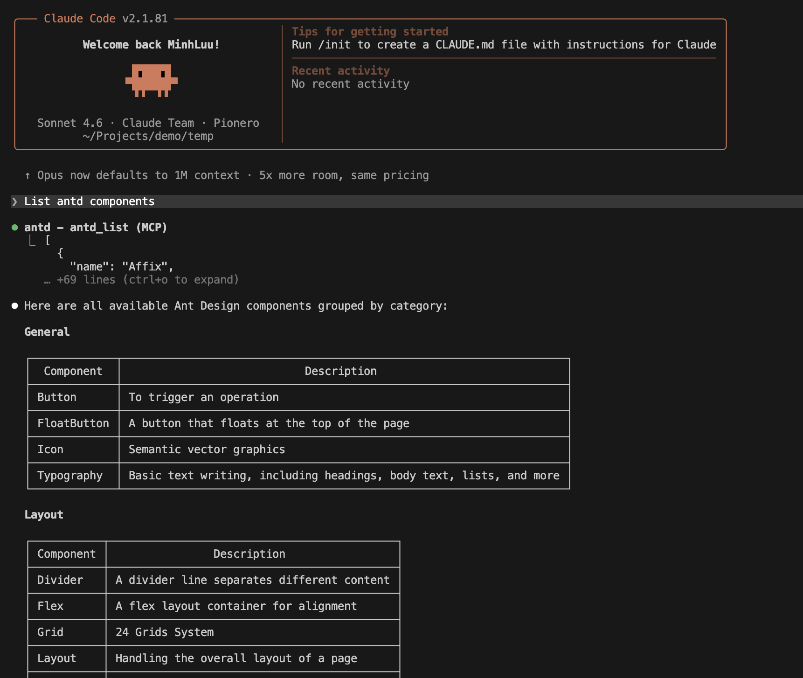

# Model Context Protocol (MCP)

> Tham khảo: https://modelcontextprotocol.io/docs/getting-started/intro

## I. MCP là gì?

- **Định nghĩa:** Model Context Protocol — giao thức mã nguồn mở do Anthropic phát triển (11/2024)
- **Mục tiêu:** Chuẩn hóa cách AI kết nối với nguồn dữ liệu & công cụ bên ngoài

---

## II. Kiến trúc tổng quát của MCP



### 1. MCP Hosts

Host là phần người dùng cuối (end users) tương tác trực tiếp với ứng dụng AI. Ví dụ như Claude Desktop, VS Code Extension, ...

Host sẽ chịu trách nhiệm:

- Quản lý tương tác và quyền của người dùng
- Khởi tạo kết nối tới MCP Servers thông qua MCP Clients
- Xử lý request của người dùng để điều hướng luồng tới các công cụ bên ngoài
- Trả về kết quả cho người dùng

### 2. MCP Client

Client là thành phần nằm trong Host giúp quản lý kết nối với MCP server cụ thể. Client có các đặc điểm:

- Mỗi client duy trì kết nối 1:1 tới một Server
- Xử lý protocol-level của MCP
- Hoạt động như phần trung gian giữa Host và Server

Với kết nối 1-1:

- Client tạo 1 đường dây riêng cho mỗi Server
- Tin nhắn gửi đến GitHub không bị lẫn với tin nhắn gửi đến Slack
- Mỗi Server chỉ nhận đúng việc của nó

### 3. MCP Server

Là chương trình bên ngoài hoặc dịch vụ cung cấp cho mô hình AI thông qua MCP protocols.

Server sẽ chịu trách nhiệm:

- Cung cấp kết nối tới các thành phần bên ngoài như các tools, nguồn dữ liệu hoặc dịch vụ
- Có thể chạy local (cùng máy với Host) hoặc remotely (thông qua mạng)
- Cung cấp chuẩn kết nối giúp Clients có thể sử dụng

Server có thể cung cấp 3 loại khả năng:

#### a. Tools — "Tay chân" của AI

Nếu AI là bộ não thì Tools chính là đôi tay — không có tay, não giỏi đến đâu cũng không làm được gì trong thế giới thực.

- Không có Tools → Claude chỉ nói được
- Có Tools → Claude làm được

**Ví dụ:**

```
Khi nhắn với Claude: "Tạo cho tôi một file báo cáo trên Google Drive"

Không có Tools:
   Claude: "Bạn có thể vào Drive, nhấn New, chọn Google Docs..."
   → Claude CHỈ hướng dẫn, không làm thay được

Có Tools (Server Google Drive):
   Claude tự động:
   1. Gọi tool "create_file"
   2. Đặt tên file "Báo cáo"
   3. Tạo xong → "File đã được tạo, đây là link của bạn!"
   → Claude TỰ LÀM luôn!
```

**Tools hoạt động như thế nào?**

```
Bạn yêu cầu Claude
        ↓
Claude hiểu cần dùng Tool nào
        ↓
Claude gọi Tool đó qua MCP Server
        ↓
Tool thực thi hành động thật
        ↓
Trả kết quả về cho Claude
        ↓
Claude báo lại cho bạn
```

#### b. Resources — "Mắt" của AI

- Là những dữ liệu AI có thể đọc và hiểu
- Nếu Tools là đôi tay (làm việc), thì Resources là đôi mắt — giúp AI nhìn thấy và hiểu thế giới bên ngoài
- Không có Resources → Claude chỉ biết những gì bạn gõ vào
- Có Resources → Claude có thể tự đi đọc dữ liệu từ bên ngoài

**Ví dụ:**

```
Bạn nhắn với Claude: "Tóm tắt file báo cáo Q1 trên Drive cho tôi"

Không có Resources:
   Bạn phải tự mở file → copy nội dung → paste vào chat
   → Mất công, thủ công

Có Resources (Server Google Drive):
   Claude tự động:
   1. Tìm file "Báo cáo Q1"
   2. Đọc toàn bộ nội dung
   3. Tóm tắt và trả lời ngay
   → Bạn không cần làm gì cả!
```

**Resources hoạt động như thế nào?**

```
Bạn hỏi Claude về dữ liệu nào đó
           ↓
Claude xác định cần đọc Resource nào
           ↓
Claude gửi yêu cầu đến MCP Server
           ↓
Server truy cập nguồn dữ liệu thật
           ↓
Trả nội dung về cho Claude "đọc"
           ↓
Claude hiểu và trả lời bạn
```

#### c. Prompts — "Kịch bản mẫu"

Hãy tưởng tượng bạn thuê một nhân viên mới. Thay vì mỗi ngày phải giải thích lại cách làm việc, bạn đưa cho họ một cuốn "Sổ tay quy trình" — làm việc gì thì theo quy trình đó. Prompts được định nghĩa và lưu trữ ngay bên trong MCP Server.

**Ví dụ:**

```
Không có Prompts

Bạn: "Tạo task mới trên Jira"
Claude: Tạo task luôn, không hỏi gì thêm
→ Task thiếu thông tin, phải sửa lại

Có Prompts (định nghĩa sẵn trong Server Jira)
Prompt: "Khi tạo task, luôn hỏi: tên task,
         mô tả, deadline, người phụ trách"

Bạn: "Tạo task mới trên Jira"
Claude: "Bạn cho tôi biết:
         1. Tên task là gì?
         2. Mô tả công việc?
         3. Deadline khi nào?
         4. Ai phụ trách?"
→ Task đầy đủ thông tin ngay từ đầu
```

**Prompts hoạt động như thế nào?**

```
Bạn kết nối Claude với MCP Server
           ↓
Server gửi Prompts lên cho Claude
           ↓
Claude "học thuộc" các quy tắc đó
           ↓
Mỗi lần dùng Server, Claude tự động
áp dụng Prompts mà không cần nhắc lại
           ↓
Bạn chỉ cần ra lệnh, Claude tự biết
làm đúng quy trình
```

---

## III. Demo Setup MCP Ant Design

### 1. Cài đặt CLI cho ant-design

```bash
npm install -g @ant-design/cli
```

### 2. Cấu hình MCP: thêm vào config claude

```bash
claude mcp add antd antd mcp
```

### 3. Test

**a. Kiểm tra claude connect với antd**

```bash
claude mcp list
```



**b. Kiểm tra đọc thông tin components của antd**

Ví dụ: List antd components


